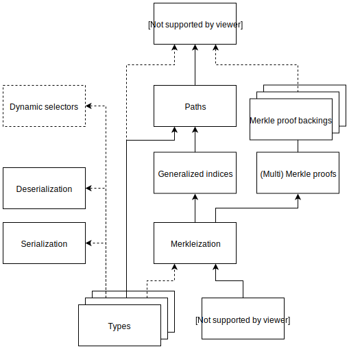

# Eth 2.0 - Simple Serialize

Simple Serialize (SSZ) is a standard for the encoding and merkleization of structured data, designed for ETH 2.0.

## Index

- [Base model](./specs/base/model.md)
  - [Series](./specs/base/model.md#series)
  - [Compound](./specs/base/model.md#compound)
- Types
  - [Basic types](./specs/types/basic.md)
  - [Bitfields](./specs/types/bitfields.md)
    - [Bitvector](./specs/types/bitfields.md#bitvector)
    - [Bitlist](./specs/types/bitfields.md#bitlist)
  - [Complex](./specs/types/complex.md)
    - [Vector](./specs/types/complex.md#vector)
    - [List](./specs/types/complex.md#lists)
    - [Container](./specs/types/complex.md#container)
  - [Union](./specs/types/union.md)
- Merkleization
  - [Hashing](./specs/merkleization/hashing.md)
  - [Merkle proofs](./specs/merkleization/merkle_proofs.md)
  - [Merkle mix-ins](./specs/merkleization/mixin.md)
  - Merkle proof backings
    - [Classic](./specs/merkleization/proof_backings/classic.md)
    - Tree offsets (WIP)
- Navigation
    - [Generalized indices](./specs/navigation/generalized_indices.md)
    - [Paths](./specs/navigation/paths.md)
    - [Summaries and expansions](./specs/navigation/summaries_expansions.md)
- [Partials](./specs/partials/partials.md)

## Design

Because of resource constraints (both space and speed) and a niche use-case for many interactions with merkleized data, existing encodings were abandoned in favor of SSZ on the ETH 2.0 stack.

The design choices for SSZ originate from the desire for:
- **Efficiency and Elegance** in proof structures with binary trees, and a design that separates opinionated sparse structures from merkleization, learning from issues in ETH 1.0.
- **Consistency** in a wide range of use-cases for minimal and efficient encoding and proofs in the core of ETH 2.0, as well as the layers being built on top.
- **Flexibility and Transparency** for tracing proofs through history, building shallow variants of types, or proofs to linked data such as between ETH 2.0 shards.
- **Stability of proof data** for stateless light clients and smart contracts. These can count on deterministic and stable locations of merkle tree leaves of interest.
- **Fast data reads** by making full deserialization optional, data can be retrieved with a very minimal amount of operations, largely pre-computable at compile time.

Minimalism and advanced use cases are almost orthogonal. To work around this, this SSZ specification maintains a strong separation of the different stack elements, and a feature introduction model with stages.

### Conceptual dependency graph

The SSZ specification has the following general architecture: 

Note that for **Types** and **Merkle proof backings**, different options exist, and the specifications building for each of the options may not all be complete, or in the same standardization stage.

### Feature stages

Features are introduced by progressing through stages, alike to the [TC39 Process implemented by EcmaScript](https://tc39.es/process-document/).

In summary, this translates to:

0. **Strawperson** 	Allow input into the specification
1. **Proposal**
   - Make the case for the addition
   - Describe the shape of a solution
   - Identify potential challenges 
2. **Draft**        Precisely describe the syntax and semantics using formal spec language 
3. **Candidate** 	Indicate that further refinement will require feedback from implementations and users 
4. **Finished** 	Indicate that the addition is ready for inclusion in the formal ECMAScript standard 

Implementations can build on the stable stage, and offer support for unfinished feature stages separately.

The proposals, drafts, candidates and finished documents are discussed through issues and PRs on GitHub, along with the relevant ETH 2.0 communication channels.

### Implementations

| Language    | Project                   | Maintainer                        | License            | Status             | Implementation |
|-------------|---------------------------|-----------------------------------|--------------------|--------------------|----------------|
| Python      | Eth 2.0                   | Ethereum Foundation               | CC0                | Spec               |                |
| Go          | Prysm                     | Prysmatic Labs                    | MIT                | Active             |[`prysmaticlabs/go-ssz`](https://github.com/prysmaticlabs/go-ssz) |
| Go          | ZRNT                      | Diederik Loerakker (@protolambda) | MIT                | Active             |[`protolambda/zssz`](https://github.com/protolambda/zssz) |
| Java        | Artemis                   | Consensys/PegaSys Eng.            | Apache-2.0         | Active             |[`PegaSysEng/artemis/util`](https://github.com/PegaSysEng/artemis/tree/master/util/src/main/java/tech/pegasys/artemis/util) |
| Java        | Harmony                   | Harmony                           | Apache-2.0         | Active             |[`harmony-dev/beacon-chain-java/ssz`](https://github.com/harmony-dev/beacon-chain-java/tree/develop/ssz) |
| Nim         | Nimbus                    | Status                            | MIT and Apache-2.0 | Active             |[`status-im/nim-beacon-chain/ssz.nim`](https://github.com/status-im/nim-beacon-chain/blob/master/beacon_chain/ssz.nim) |
| Python      | Trinity                   | Ethereum Foundation               | MIT                | Active             |[`ethereum/py-ssz`](https://github.com/ethereum/py-ssz) |
| Rust        | Lighthouse                | Sigma Prime                       | Apache-2.0         | Active             |[`sigp/lighthouse/ssz`](https://github.com/sigp/lighthouse/tree/master/eth2/utils/ssz) |
| Rust        | Shasper                   | ParityTech                        | GPL-3.0            | Active             |[`paritytech/shasper/ssz`](https://github.com/paritytech/shasper/tree/master/utils/ssz) |
| Typescript  | Lodestar                  | Chainsafe Systems                 | LGPL-v3.0          | Active             |[`ChainSafe/lodestar/ssz`](https://github.com/ChainSafe/lodestar/tree/master/packages/ssz) |
| C#          | Cortex                    | Sly Gryphon (@sgryphon)           | LGPL-v3.0          | Under construction |[`sgryphon/cortex-ssz`](https://github.com/sgryphon/cortex-ssz) |
| TypeScript  | Lodestar                  | ChainSafe Systems                 | Apache-2.0         | Archived           |[`ChainSafe/ssz-js`](https://github.com/ChainSafe/ssz-js) |
| Java        | Cava                      | ConsenSys                         | Apache-2.0         | Archived           |[`ConsenSys/cava/ssz`](https://www.github.com/ConsenSys/cava/tree/master/ssz) |
| Swift       | Yeeth                     | Dean Eigenmann (@decanus, @yeeth) | MIT                | Incomplete         |[`yeeth/SimpleSerialize.swift`](https://github.com/yeeth/SimpleSerialize.swift) |
| C#          | -                         | Jordan Andrews (@codingupastorm)  | MIT                | Discontinued       |[`codingupastorm/csharp-ssz`](https://github.com/codingupastorm/csharp-ssz) |
| C++         | -                         | Jiyun Kim (@NAKsir-melody)        | -                  | Discontinued       |[`NAKsir-melody/cpp_ssz`](https://github.com/NAKsir-melody/cpp_ssz) |

## License

`CC0 1.0 Universal`. See License file.
